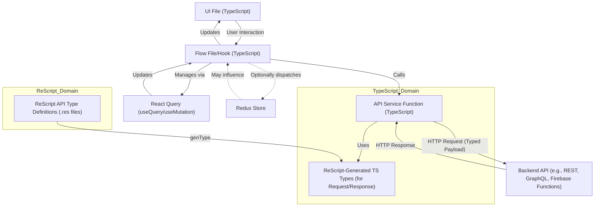

# General API Integration Patterns

This document describes the patterns for integrating with backend APIs, focusing on the use of ReScript for API type definitions and the general data flow.

## Language Strategy for API Interaction

*   **TypeScript for Application Logic:** All application logic, including initiating API calls (typically from Flow files/hooks or dedicated API service functions), is written in TypeScript.
*   **ReScript for API Type Definitions:**
    *   ReScript is **strictly limited** to defining the types for API request payloads and response structures.
    *   This ensures strong type safety at the boundary between the TypeScript application and the backend APIs.
    *   ReScript type definitions are typically located in `src/api/` or similar, and `genType` is used to generate corresponding TypeScript type definitions (`.gen.tsx` files) that can be imported and used by TypeScript code.
    *   This approach leverages ReScript's powerful type system for robust API contracts.

## Data Flow for API Interaction

A typical data flow involving an API call, often managed by React Query within a Flow file/hook:

1.  **Action Trigger (UI/Flow):**
    *   A user interaction in a UI file dispatches an action via `mpDispatch`.
    *   The Flow file's resolver handles this action, determining that an API call is needed.

2.  **Initiating API Call (Flow File / API Service):**
    *   The Flow file (or a custom hook it uses) calls an **API service function**. These functions are typically asynchronous and written in TypeScript.
    *   API service functions are responsible for:
        *   Constructing the request payload, using the **ReScript-generated TypeScript types** to ensure the payload matches the API contract.
        *   Making the actual HTTP request (e.g., using `fetch` or a library like `axios`).
        *   Handling the HTTP response.
        *   Parsing the response body (e.g., `response.json()`).
        *   Validating or transforming the response data, again using **ReScript-generated TypeScript types** to ensure the response structure is as expected.

3.  **React Query Integration (Common):**
    *   **`useQuery`:** For GET requests, the API service function is passed as the query function. React Query handles caching, loading states, error states, and re-fetching.
    *   **`useMutation`:** For POST, PUT, DELETE requests, the API service function is passed as the mutation function. React Query handles mutation states and can be configured for optimistic updates or cache invalidation.

4.  **Type Safety at Boundaries:**
    *   **Request:** TypeScript code preparing the request payload benefits from the strong types generated from ReScript, preventing incorrect data structures from being sent.
    *   **Response:** TypeScript code handling the response benefits from the same strong types, ensuring that the application correctly interprets the data received from the API.

5.  **State Update & UI Re-render:**
    *   **React Query:** Automatically updates its cache and provides new data/status (loading, error, success) to the hook in the Flow file.
    *   **Redux (Optional):** If necessary, data from the API response can be dispatched to the Redux store (e.g., in an `onSuccess` callback of `useQuery` or `useMutation`).
    *   The Flow file re-evaluates its logic based on the new data/state from React Query (and/or Redux).
    *   The Flow file prepares an updated view state and re-renders the UI file.

## Firebase for Backend Services

*   The application leverages Firebase for various backend needs (Analytics, Auth, Firestore, Messaging, Remote Config).
*   Client-side Firebase SDKs are used for these integrations.
*   While Firebase SDKs often have their own typing, if custom backend functions (e.g., Firebase Cloud Functions) are called directly via HTTP, the ReScript API type strategy would apply to those interactions as well.

## Visual Overview

This pattern ensures that despite using TypeScript for most of the application, the critical API boundaries are protected by the robust type system of ReScript, translated for TypeScript consumption via `genType`.
