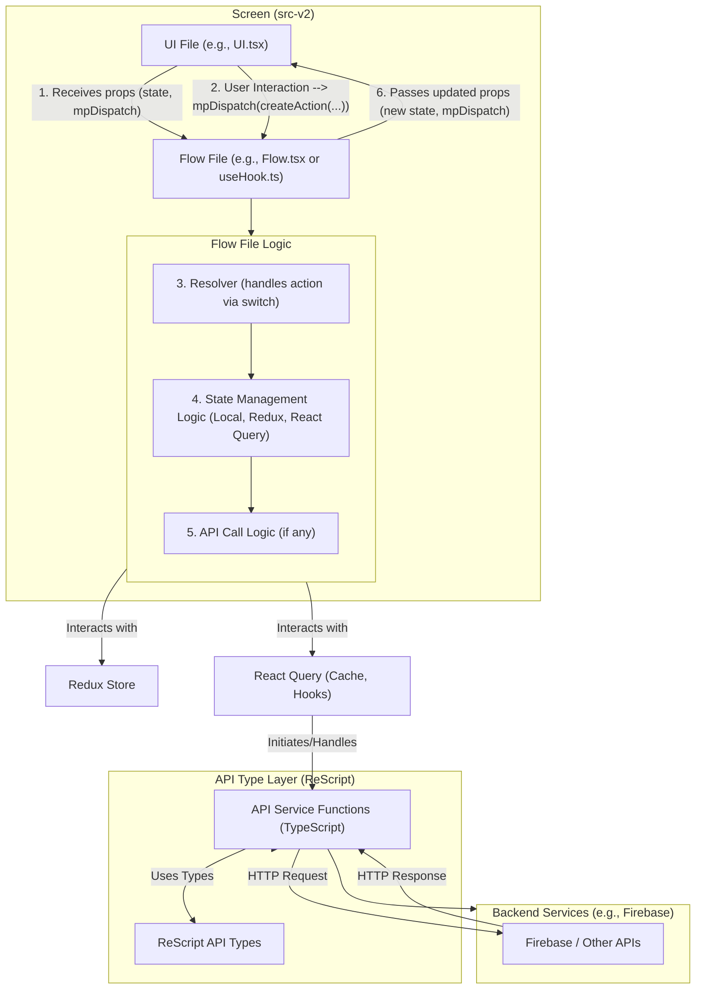

# System Patterns Overview

This document provides a high-level overview of the system architecture and key design patterns employed in the application. For detailed information on specific patterns, please refer to the linked documents.

## Core Architecture Principles

*   **Mobile Application:** Built with React Native.
*   **Primary Language (UI & Logic):** TypeScript, with all new development in `src-v2/`.
*   **API Type Definitions:** ReScript is used exclusively for defining API type contracts (see [./systemPatterns_general/apiIntegration.md](./systemPatterns_general/apiIntegration.md)).
*   **Legacy Code:** ReScript code in `src/` for UI is considered legacy and not for new development.
*   **Component-Based UI:** Standard React Native approach, with custom primitives and feature components in `src-v2/` (see [./systemPatterns_general/uiArchitecture.md](./systemPatterns_general/uiArchitecture.md)).
*   **State Management:** A mix of Redux Toolkit (global client state) and React Query (server state) (see [./systemPatterns_general/stateManagement.md](./systemPatterns_general/stateManagement.md)).
*   **Navigation:** React Navigation is used for all screen flows (see [./systemPatterns_general/navigation.md](./systemPatterns_general/navigation.md)).
*   **Styling:** TailwindCSS via `twrnc` (see [./systemPatterns_general/uiArchitecture.md](./systemPatterns_general/uiArchitecture.md)).

## General System Patterns

These patterns apply broadly across the application:

*   **UI Architecture:** Describes screen development (UI/Flow separation), component structure, primitives, and styling.
    *   Details: [./systemPatterns_general/uiArchitecture.md](./systemPatterns_general/uiArchitecture.md)
*   **State Management:** Covers Redux Toolkit and React Query usage, and utility hook patterns.
    *   Details: [./systemPatterns_general/stateManagement.md](./systemPatterns_general/stateManagement.md)
*   **Navigation:** Outlines the use of React Navigation, stack/tab structures, and type-safe navigation.
    *   Details: [./systemPatterns_general/navigation.md](./systemPatterns_general/navigation.md)
*   **API Integration:** Details the TypeScript/ReScript strategy for API calls and data flow.
    *   Details: [./systemPatterns_general/apiIntegration.md](./systemPatterns_general/apiIntegration.md)
*   **Functional Programming:** Encouraged by ESLint rules for TypeScript (immutability, `no-let`).
*   **Import Strategy:** Direct imports are required; no barrel files for components/flows/types.

## Feature-Specific System Patterns

Patterns tailored to specific major features or domains:

*   **Authentication & User Profile:** Covers login/registration flows, session management.
    *   Details: [./features/authentication/patterns.md](./features/authentication/patterns.md)
*   **Ride Booking - Search:** Patterns for searching rides, displaying options, map integration for search.
    *   Details: [./features/rideBooking/patterns_search.md](./features/rideBooking/patterns_search.md)
*   **Ride Booking - Tracking:** Patterns for real-time vehicle tracking, map display for tracking, status updates.
    *   Details: [./features/rideBooking/patterns_tracking.md](./features/rideBooking/patterns_tracking.md)
*   **Multimodal Engine (including Journey Rule Engine):** Describes the centralized rule engine for complex journey logic.
    *   Details: [./features/multimodalEngine/patterns_overview.md](./features/multimodalEngine/patterns_overview.md)
*   **(Planned) Home Screen Patterns:** (Link to `features/homeScreen/patterns.md` once populated)
*   **(Planned) Favourites Flow Patterns:** (Link to `features/favourites/patterns.md` once populated)
*   **(Planned) Miscellaneous Feature Patterns:** (Link to `features/miscFeatures/patterns.md` once populated)

## Overall Data Flow (High-Level)

A general overview of data flow within a screen following the UI/Flow pattern:

1.  **Initialization (Flow File):** Manages state (local, Redux, React Query), prepares initial view state and `mpDispatch`.
2.  **Render (UI File):** Receives props from Flow file.
3.  **User Interaction (UI File):** Dispatches actions via `props.mpDispatch(createAction(...))`.
4.  **Action Processing (Flow File):** Resolver handles actions, updates state, calls APIs.
5.  **State Updates & Re-render:** State changes (local, Redux, React Query) trigger re-render of Flow, then UI.
6.  **API Interaction:** API calls use ReScript-generated types for safety.

This overview serves as a map to the more detailed pattern documentation.
